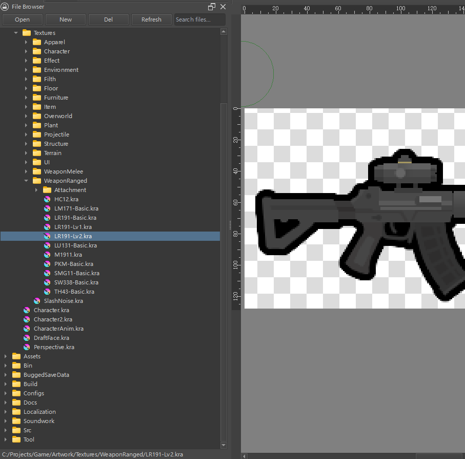

# Krita File Browser

A VSCode-like file browser plugin for Krita. Browse directories, open/create/delete files, and search — all without leaving Krita.



## Features

- **Directory browsing** — Open any directory and browse supported image files in a tree view
- **Quick file operations** — Create new `.kra` files with custom dimensions/resolution/color settings, delete files, open files by double-click
- **Recursive search** — Search files by name across all subdirectories
- **Auto-restore** — Remembers your last opened directory between sessions

## Supported Formats

`.kra` `.krz` `.ora` `.psd` `.xcf` `.svg` `.png` `.jpg` `.jpeg` `.gif` `.tif` `.tiff` `.bmp` `.exr` `.webp` `.heif` `.heic` `.jp2` `.jxl` `.tga` `.hdr` `.pdf`

## Installation

1. Download or clone this repository
2. Locate your Krita resources folder: Krita → Settings → Manage Resources → Open Resources Folder
3. Find the `pykrita` subdirectory inside it
4. Copy `krita_file_browser.desktop` and the `krita_file_browser/` folder into `pykrita/`
5. Create an `actions/` folder inside `pykrita/` if it doesn't exist, then copy `krita_file_browser.action` into it
6. Restart Krita
7. Go to **Settings → Configure Krita → Python Plugin Manager**, find "File Browser", and enable it
8. Restart Krita again
9. Go to **Settings → Dockers** and check **File Browser** to show the panel

### Quick install (Windows PowerShell)

```powershell
$src = "C:\path\to\KritaFileBrowser"       # Change to your clone path
$dst = Join-Path $env:APPDATA "krita\pykrita"

Copy-Item "$src\krita_file_browser.desktop" $dst
Copy-Item -Recurse "$src\krita_file_browser" $dst
$actionsDir = Join-Path $dst "actions"
New-Item -ItemType Directory -Path $actionsDir -Force | Out-Null
Copy-Item "$src\krita_file_browser.action" $actionsDir
```

## Usage

- **Open directory** — Click the "Open" button and select a folder
- **Open file** — Double-click any file in the tree
- **New file** — Click "New", set filename/dimensions/resolution/color, click OK
- **Delete file** — Select a file, click "Del", confirm
- **Search** — Type in the search box, results appear from all subdirectories
- **Clear search** — Empty the search box to return to tree view

## License

[MIT](LICENSE)
